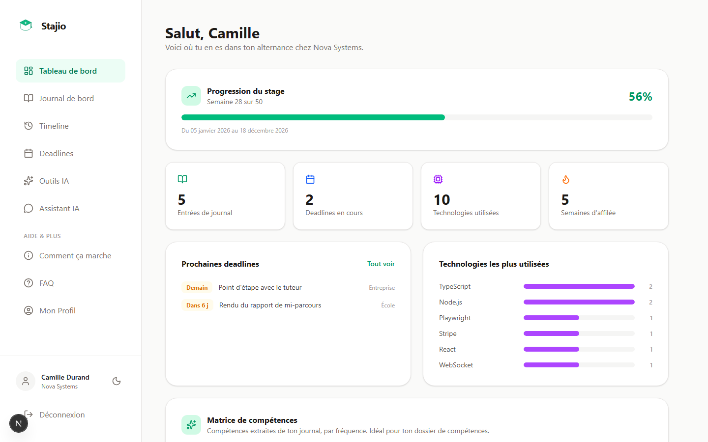
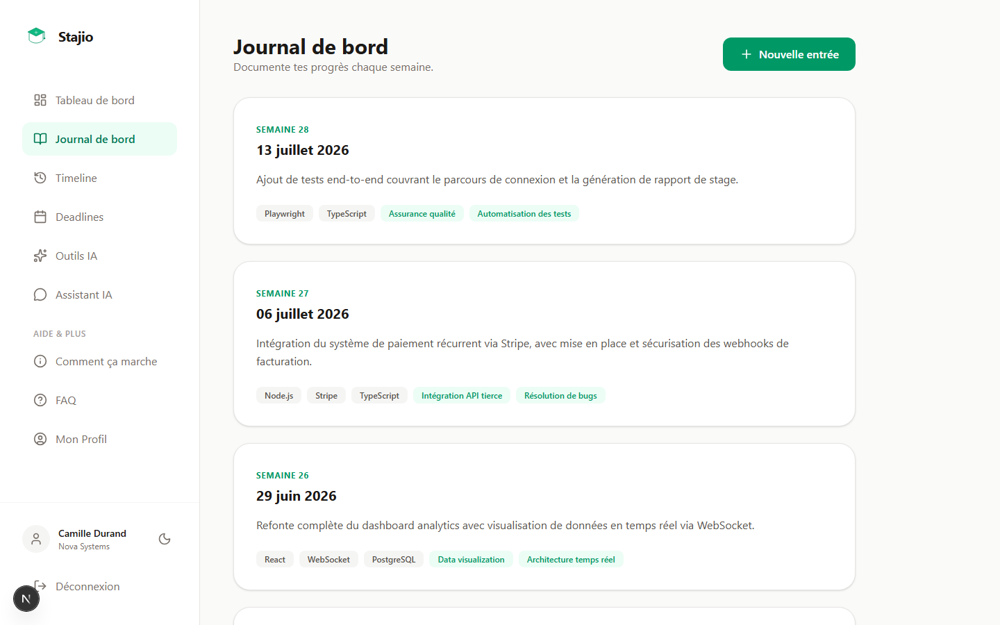
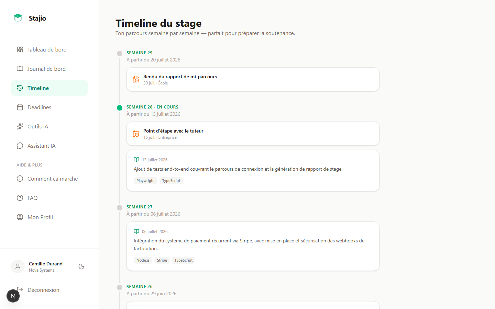
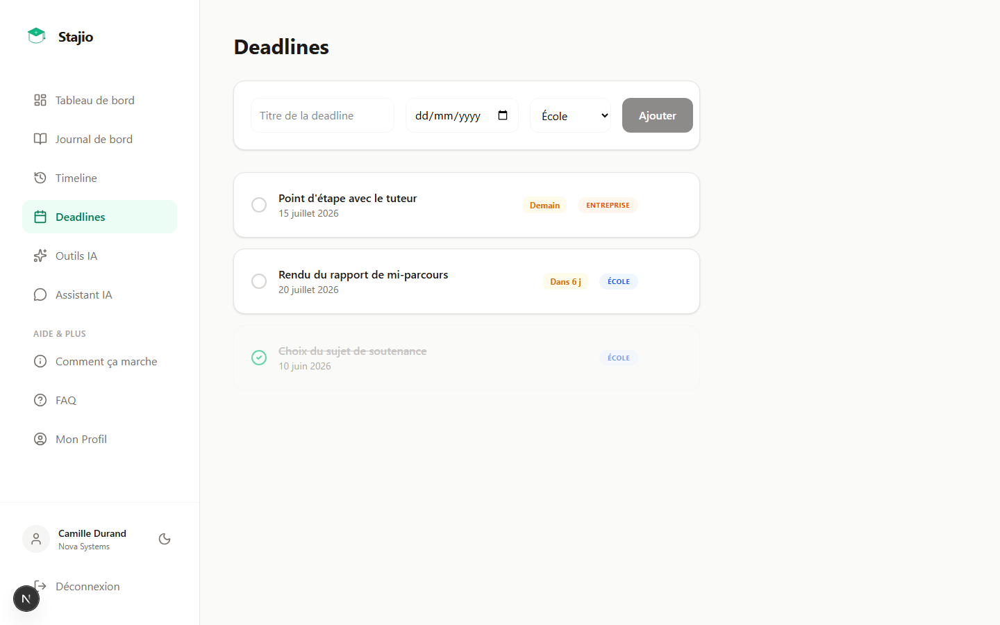
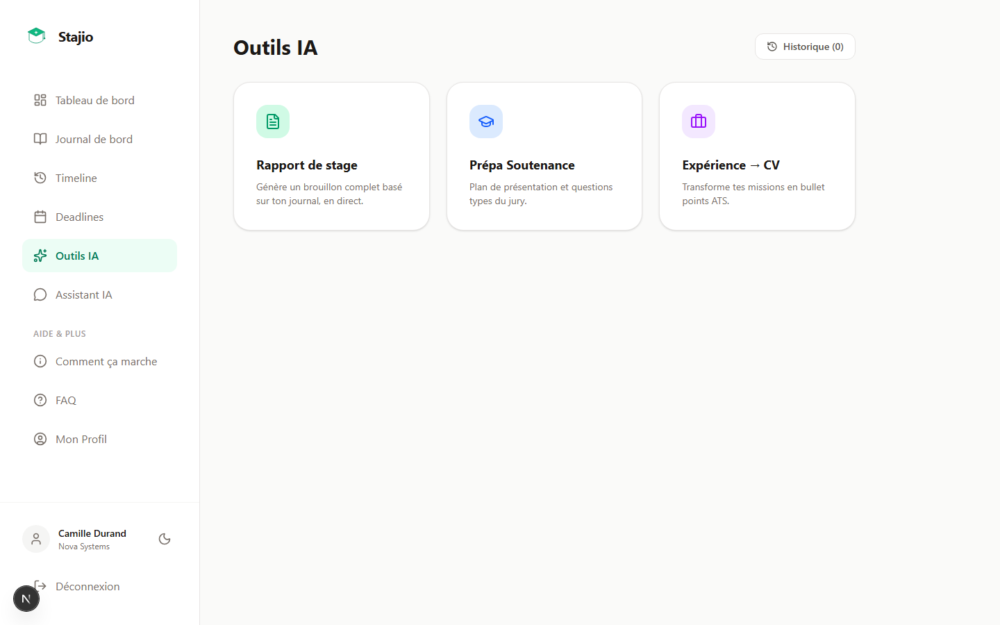
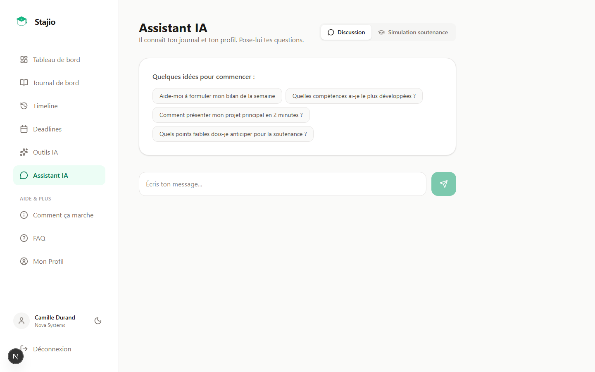
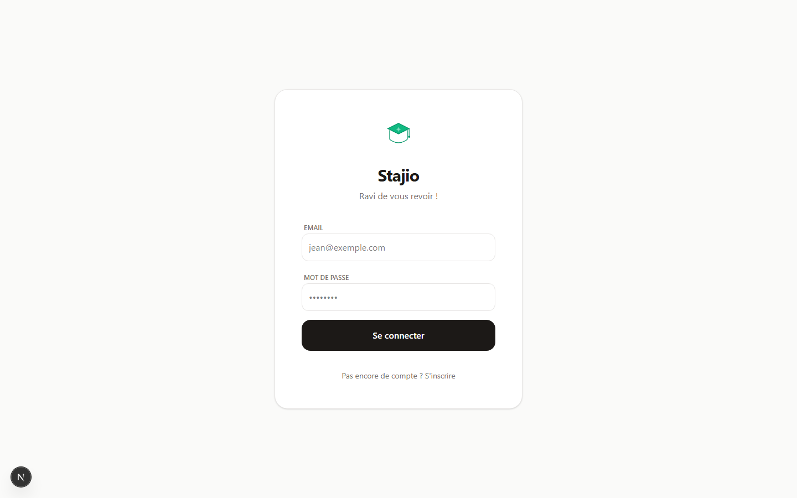
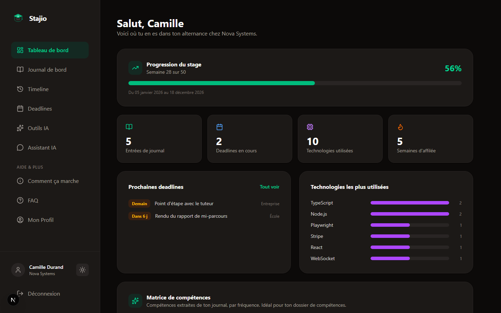

<div align="center">
  
  <h1>Stajio</h1>
  <p><strong>Assistant intelligent de suivi d'alternance et de stage, en local-first.</strong></p>

  <p>
    <a href="https://nextjs.org/"></a>
    <a href="https://react.dev/"></a>
    <a href="https://ollama.com/"></a>
    <a href="https://www.sqlite.org/"></a>
    <a href="https://www.typescriptlang.org/"></a>
  </p>
</div>

## Aperçu

Stajio aide les étudiants en alternance ou en stage à centraliser leur journal de bord et leurs deadlines, et à générer automatiquement les livrables associés (rapport de stage, préparation de soutenance, points CV) grâce à une IA locale servie par Ollama.

Le projet est local-first : aucune donnée ni aucun appel IA ne transite par un service cloud tiers. Toute la stack (base de données, inférence du modèle) tourne sur la machine de l'utilisateur.

## Démo

L'application n'a pas de démo hébergée publiquement : elle repose sur Ollama tournant en local, ce qui est la contrainte du choix local-first (pas de dépendance à une clé API cloud, pas de coût d'inférence, données jamais envoyées à un tiers). La section [Installation locale](#installation-locale) permet de la lancer en moins de 5 minutes.

| Tableau de bord | Journal de bord |
|---|---|
|  |  |

| Timeline du stage | Deadlines |
|---|---|
|  |  |

| Outils IA | Assistant IA |
|---|---|
|  |  |

<details>
<summary>Voir aussi : écran de connexion et thème sombre</summary>
<br />

| Connexion | Thème sombre |
|---|---|
|  |  |

</details>

## Fonctionnalités

- Tableau de bord : progression du stage, statistiques, streak d'assiduité, matrice de compétences
- Journal de bord intelligent (structuration missions / technologies / compétences par l'IA), avec édition et re-structuration
- Timeline du stage semaine par semaine (journal + deadlines), utile pour préparer la soutenance
- Gestion des deadlines école / entreprise : badges d'urgence, édition, suppression
- Génération de rapport de stage en streaming (Markdown, affichage token par token)
- Préparation de soutenance (plan de présentation + questions probables du jury)
- Simulation de soutenance interactive : l'IA pose les questions, note chaque réponse et propose une reformulation
- Assistant IA contextuel (chat en streaming, avec accès au journal et au profil de l'utilisateur)
- Optimisation CV : missions transformées en bullet points ATS
- Historique des générations IA (sauvegarde, relecture, suppression)
- Export PDF natif (texte sélectionnable, pas une capture d'écran) des résultats IA
- Export / import complet des données au format JSON
- Choix du modèle Ollama utilisé, directement depuis les réglages
- Validation stricte des payloads (Zod) sur toutes les routes API
- Authentification par JWT en cookie HTTP-only
- Interface responsive, thème clair / sombre persistant

## Architecture

- **Frontend** : Next.js 16 (App Router) + React 19, Tailwind CSS 4
- **Backend** : Route Handlers Next.js (`app/api/*`)
- **Base de données** : SQLite (`better-sqlite3`)
- **IA** : Ollama en local (modèle configurable, ex. `llama3.2`)

### Points techniques

- Aucune clé API cloud requise pour l'IA
- Données utilisateur stockées localement en SQLite
- Séparation claire front / backend via une couche d'API interne (`src/services`)
- Routes IA dédiées : `/api/ai` (réponse complète), `/api/ai/stream` (streaming token par token), `/api/ai/models` (liste des modèles Ollama disponibles)
- Historique des générations persisté (`/api/ai-outputs`)
- Export / import de toutes les données (`/api/export`, `/api/import`)
- Validation systématique des entrées API avec Zod, avec messages d'erreur détaillés

## Installation locale

1. Cloner le dépôt

```bash
git clone https://github.com/Nadjide/stajio.git
cd stajio
```

2. Installer les dépendances

```bash
npm install
```

3. Configurer l'environnement

```bash
cp .env.example .env
```

Puis ajuster `.env` si besoin (modèle Ollama, secret JWT en production).

4. Lancer Ollama et récupérer un modèle

```bash
ollama serve
ollama pull llama3.2
```

5. Démarrer l'application

```bash
npm run dev
```

Application disponible sur `http://localhost:3001`.

## Scripts utiles

- `npm run dev` : développement
- `npm run build` : build production
- `npm run start` : démarrage production (nécessite un build)
- `npm run lint` : vérification des types TypeScript
- `npm run lint:code` : lint ESLint
- `npm run format` : formatage Prettier
- `npm run test` : tests unitaires et API (Vitest)
- `npm run test:e2e` : tests end-to-end (Playwright ; nécessite `npx playwright install chromium` une première fois)
- `npm run check` : pipeline complète (lint + tests + build)

## Qualité logicielle

- ESLint (config Next.js + hooks React)
- Prettier avec plugin Tailwind
- Vitest : tests de validation, de repositories (isolation par utilisateur) et de routes API
- Playwright : test end-to-end du parcours d'authentification
- CI GitHub Actions : lint, tests, build et E2E sur chaque push et pull request

## Sécurité

- Mots de passe hashés avec bcrypt, jamais renvoyés par l'API
- JWT signé (`JWT_SECRET`), stocké en cookie HTTP-only
- Toutes les routes de données sont scoped par utilisateur (un utilisateur ne peut lire ni modifier les données d'un autre)
- Validation stricte des entrées (Zod) sur l'ensemble des routes API
- En production : HTTPS obligatoire et secret JWT robuste et dédié

## Roadmap

- Observabilité (logs structurés côté serveur)
- Notifications navigateur pour les deadlines à venir
- Mapping de la matrice de compétences vers un référentiel de certification (RNCP)

## Points forts du projet

- Cas d'usage réel et concret pour un public précis (étudiants en alternance / stage)
- Architecture full-stack moderne avec séparation nette des responsabilités
- Intégration d'une IA locale plutôt qu'un simple appel à une API cloud : contrainte technique assumée et différenciante
- Fonctionnalités IA avancées : streaming, historique, simulation interactive avec évaluation
- Couverture de tests à plusieurs niveaux (unitaire, API, end-to-end) et CI configurée

## Licence

MIT — voir [LICENSE](LICENSE).
